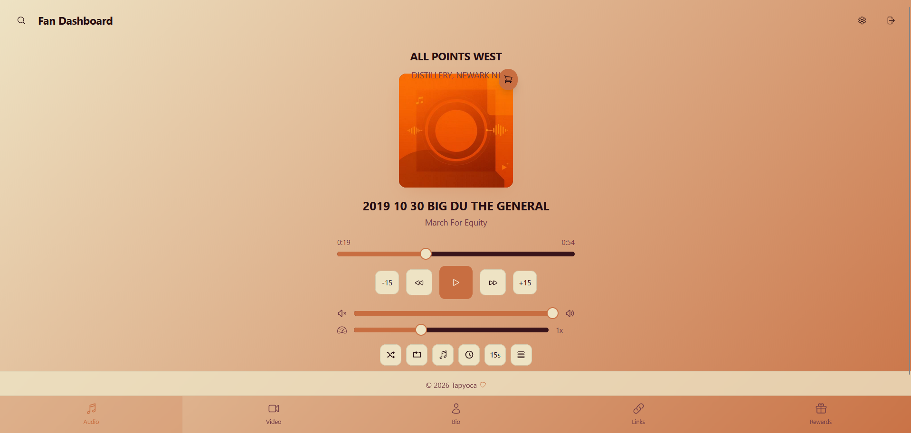
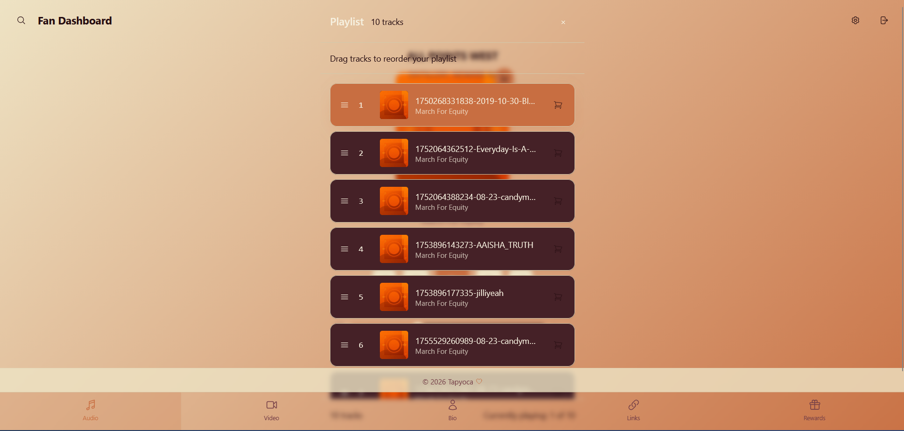
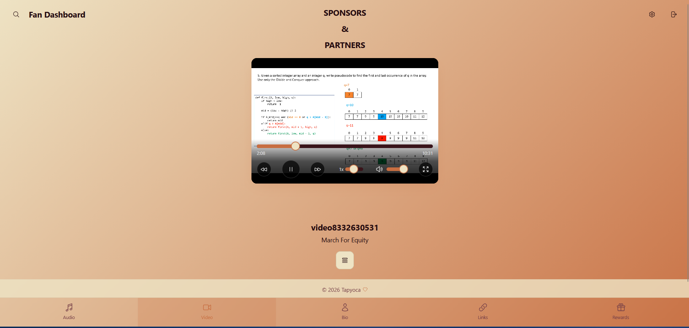
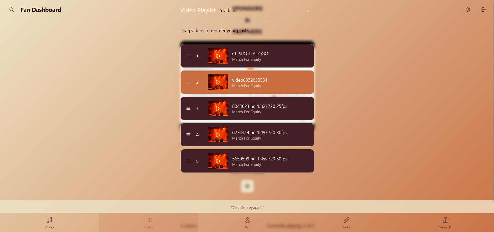
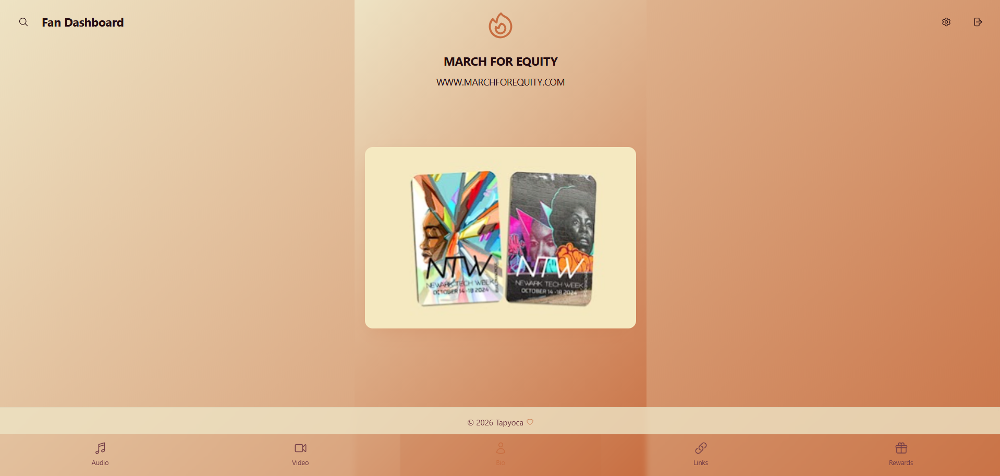
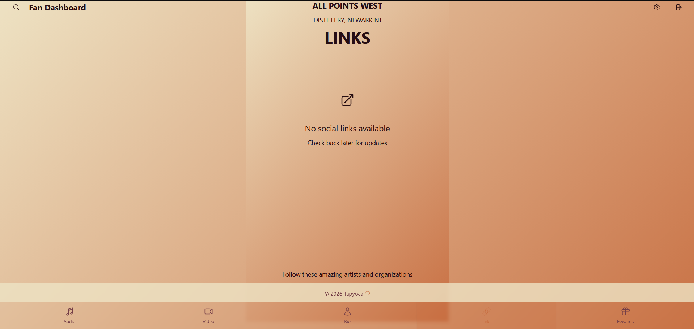
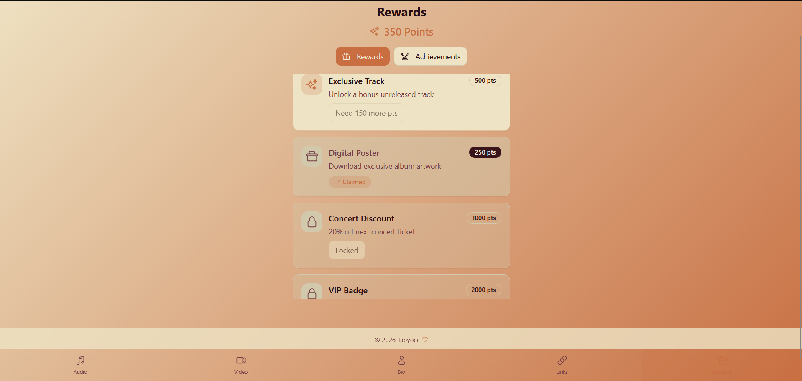
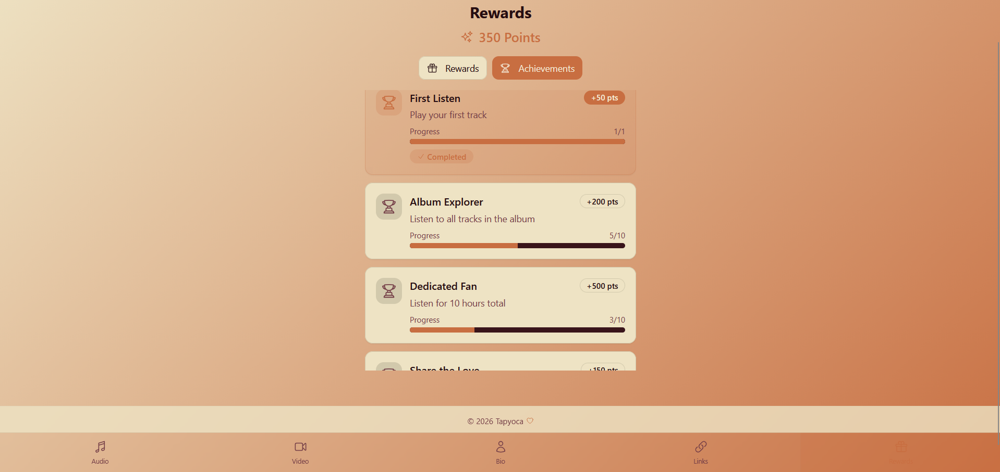
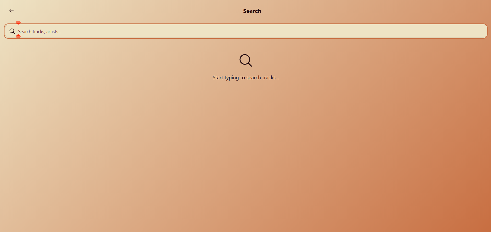
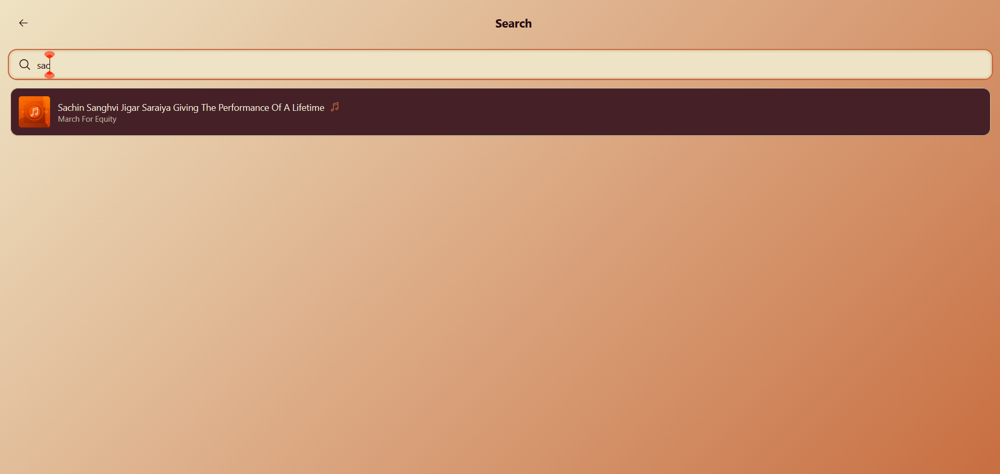

# Client Dashboard (Tapyoca)

## Project Overview

**Project:** Client Dashboard (Fan Dashboard)
**Purpose:** To provide a web-based interactive media dashboard for fans and event participants, enabling audio/video playback, NFC-based access, rewards, and user interaction features.

---

## Tech Stack
- **Frontend Framework:** React (with TypeScript)
- **Bundler/Dev Server:** Vite
- **Styling:** Tailwind CSS, shadcn-ui, custom CSS
- **Data/Backend:** Uses Supabase for authentication and data (via `@supabase/supabase-js`)
- **Other Libraries:**
  - Radix UI primitives
  - React Router
  - React Query
  - Sonner (for toasts/notifications)
  - React Icons, Lucide React
  - Embla Carousel, Video React, hls.js (for media)
  - React Hook Form, Zod (validation)

---

## Feature Highlights
- **Media Playback:**
  - Audio and video tracks with progress, seek, shuffle/repeat, persistent/restore states, volume & playback speed controls.
  - Enhanced UI/UX with floating mini player, drag-and-drop playlist reordering, lyrics, and sleep timers.
  - Mocked music/video data enables demo use without backend complexity.

- **NFC Access:**
  - NFC access simulation included for demonstration/feature gating.

- **Authentication:**
  - Secure login via Supabase; dynamic route protection.

- **Rewards & Social:**
  - In-app rewards, shopping cart modal, and Instagram/social linking.

- **Modern UI:**
  - Responsive, mobile-friendly with cards, tabs, gradients, and shadcn-ui primitives.

- **Custom Hooks & State:**
  - All complex business logic managed via easy-to-understand hooks and utility functions.

---

## How to Run/Develop Locally

1. **Clone the repository**
    ```bash
    git clone https://github.com/Deeppatel911/TapyocaClientDashboard
    cd client-dashboard
    ```
2. **Install dependencies**
    ```bash
    npm i
    ```
3. **Start the development server**
    ```bash
    npm run dev
    ```
4.**View the app**
    - Open your browser and go to the printed local address: http://localhost:8080 to view the dashboard.

> Dependencies are managed in `package.json`. See that file or use `npm list` for details.

---

## Screenshots
| **Audio Player & Playlist** 
|:---:|:---:|
|  |  |

| **Video Player & Playlist**
|:---:|:---:|
|  |  |

| **Bio** 
|:---:|:---:| 
|  |

| **Links** 
|:---:|:---:| 
|  |

| **Rewards & Achievements** 
|:---:|:---:| 
|  |  |

|**Search Functionality**
|:---:|:---:|
|  |  |

---
