# Client Dashboard (Tapyoca)

## Project Overview

**Project:** Client Dashboard (Fan Dashboard)
**Purpose:** A web-based interactive media dashboard for fans and event participants — enabling
audio/video streaming, a simulated NFC access gate, engagement analytics, tiered rewards,
personalized recommendations, and user-interaction features.

---

## Tech Stack
- **Frontend Framework:** React (with TypeScript)
- **Bundler/Dev Server:** Vite
- **Styling:** Tailwind CSS, shadcn-ui, custom CSS
- **Data/Backend:** Supabase — Authentication, Postgres, and Storage (via `@supabase/supabase-js`)
- **Other Libraries:**
  - Radix UI primitives (shadcn-ui)
  - React Router (routing)
  - React Query (server-state)
  - Recharts (analytics charts)
  - @hello-pangea/dnd (drag-and-drop playlist reordering)
  - react-h5-audio-player & video-react (media playback)
  - Sonner (toasts/notifications)
  - React Icons, Lucide React
  - React Hook Form, Zod (validation)

---

## Feature Highlights

- **Media Playback & Streaming:**
  - Audio and video streamed directly from **Supabase Storage** (public buckets).
  - Progress, seek, shuffle/repeat, persistent & resume state, volume, and playback-speed controls.
  - Drag-and-drop playlist reordering, lyrics, and sleep timers.

- **Recommendations:**
  - A **"Recommended for you"** shelf on both the Audio and Video tabs.
  - Behavioral, per-user suggestions scored from the listener's own playback history, each tagged
    with a reason (e.g. "Because you like …", "New to you").

- **Analytics Dashboard:**
  - Backed by an **event-sourced analytics pipeline** (6 playback event types) that produces
    accurate metrics — overview KPIs (total plays, listening time, favorite track, avg duration).
  - Interactive charts: bar (top tracks), line (30-day listening timeline), and pie (completion
    rate); top-played / most-skipped / favorite-artist lists; and a detailed per-track table.
  - Filter views by audio / video / all media types.

- **Rewards (Achievements + Fan Tiers):**
  - Fully **dynamic**, derived from real playback analytics — no hardcoded data.
  - **Achievements** with live progress and points (e.g. First Listen, Library Explorer,
    Dedicated Fan, Completionist, Cinephile).
  - A **Fan Tier** progression (Bronze → Silver → Gold → VIP) earned purely from points,
    replacing the earlier claimable-merchandise concept (posters, concert discounts, etc.).

- **Search:**
  - Search the catalog by track title or artist, with tap-to-play into the correct player.

- **NFC Access:**
  - A **simulated** session-based NFC access gate for demonstration/feature gating.

- **Authentication:**
  - Supabase email/password auth — sign up, sign in, and password reset — with route protection.

- **Content Protection:**
  - Client-side deterrents against casual downloading (right-click, common save/devtools
    shortcuts, drag, and media control hiding).

- **Modern, Responsive UI:**
  - Mobile-first, responsive layout with tabs, cards, gradients, and shadcn-ui primitives.

- **Custom Hooks & State:**
  - Business logic (data, playback, analytics, rewards, recommendations) is organized into
    focused, easy-to-follow hooks and utilities.

---

## How to Run/Develop Locally

1. **Clone the repository**
    ```bash
    git clone https://github.com/Deeppatel911/TapyocaClientDashboard
    cd client-dashboard
    ```
2. **Install dependencies**
    ```bash
    npm i
    ```
3. **Start the development server**
    ```bash
    npm run dev
    ```
4. **View the app**
    - Open your browser and go to the printed local address: http://localhost:8080 to view the dashboard.

> Dependencies are managed in `package.json`. See that file or use `npm list` for details.

---

## Screenshots
| **Audio Player, Recommendations, and Playlist** 
|:---:|:---:|
| 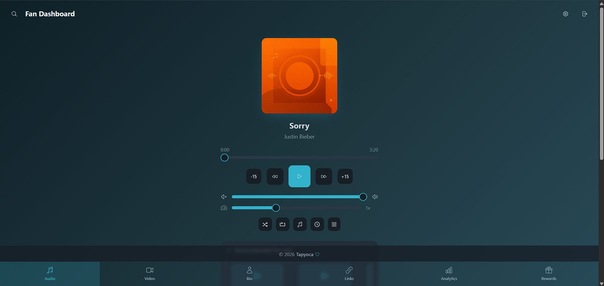 | 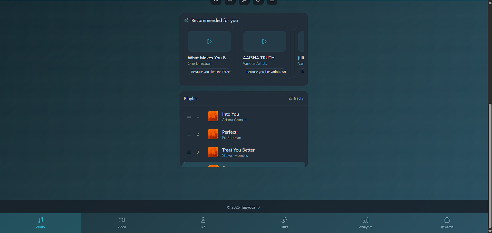 |

| **Video Player, Recommendations, and Playlist**
|:---:|:---:|
| 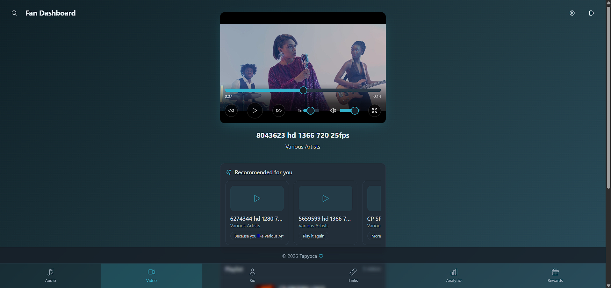 | 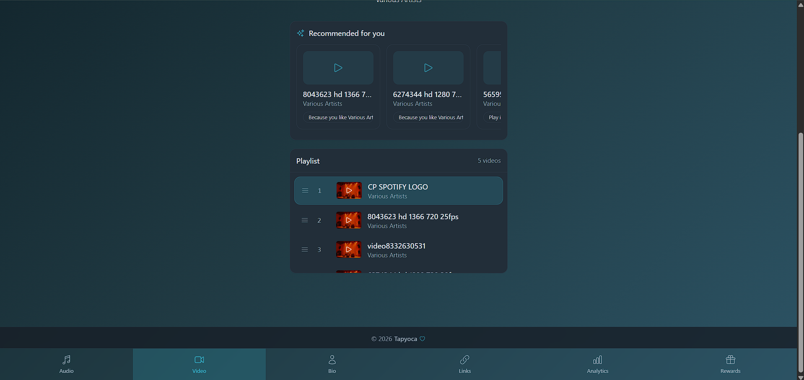 |

| **Bio** 
|:---:|:---:| 
| 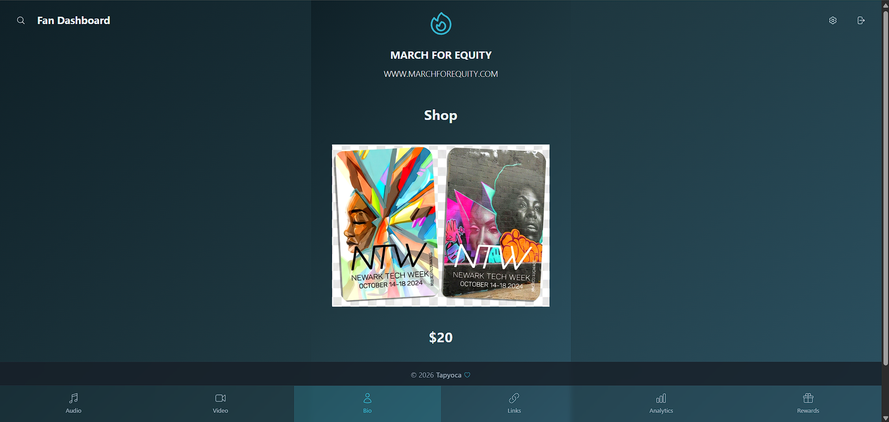 |

| **Links** 
|:---:|:---:| 
| 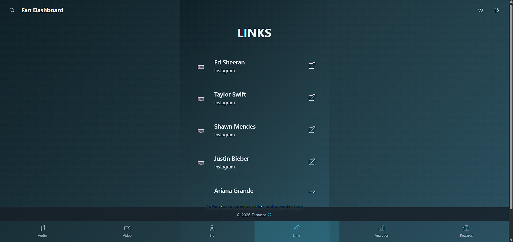 |

| **Analytics Dashboard**
|:---:|:---:|
| 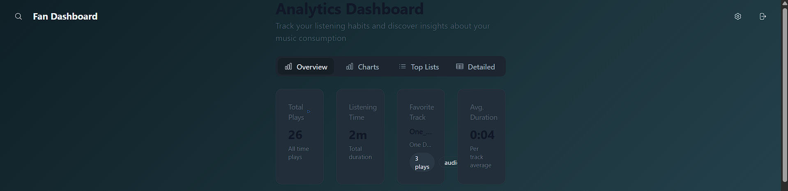 | 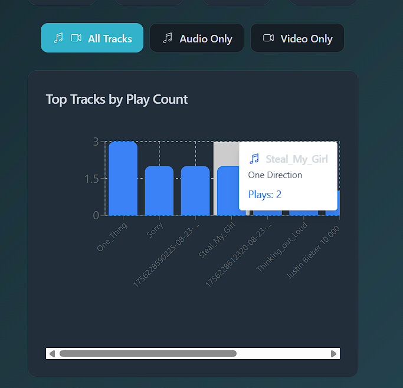 | 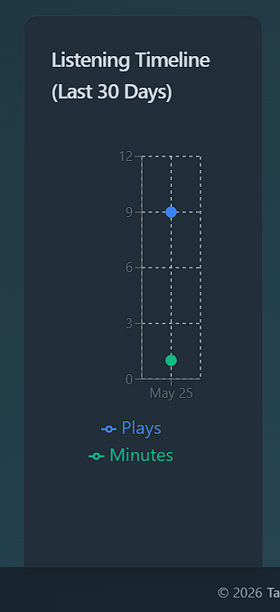 | 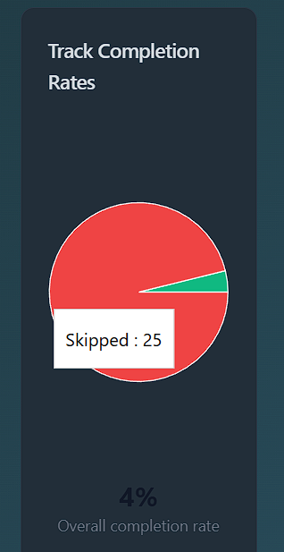 | 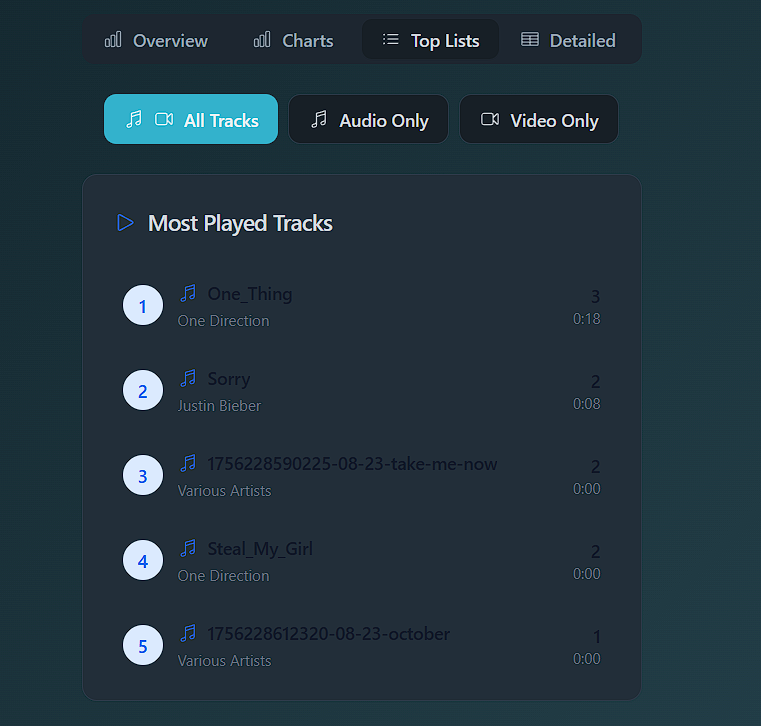 | 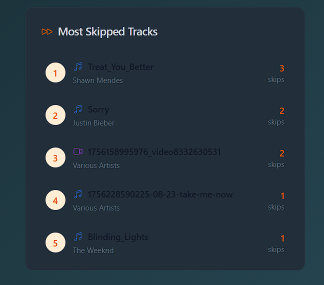 | 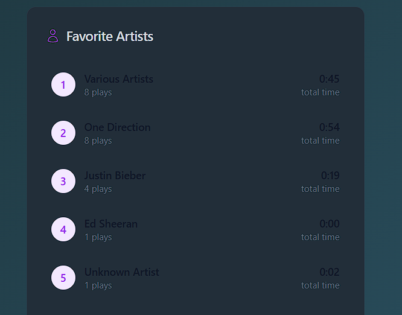 | 

| **Rewards (Achievements & Fan Tiers)** 
|:---:|:---:| 
| 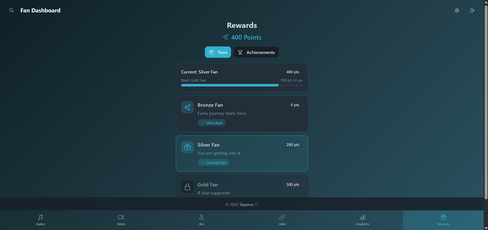 | 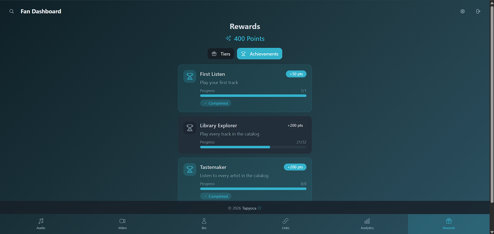 | 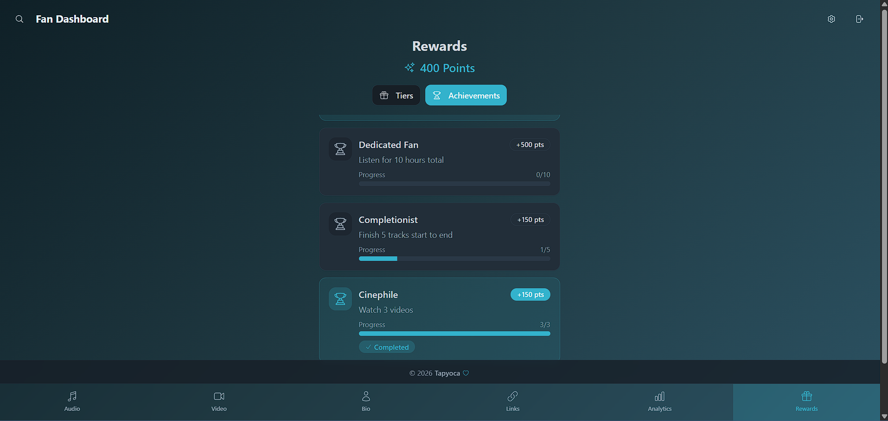 |

|**Search Functionality**
|:---:|:---:|
|  |

---
